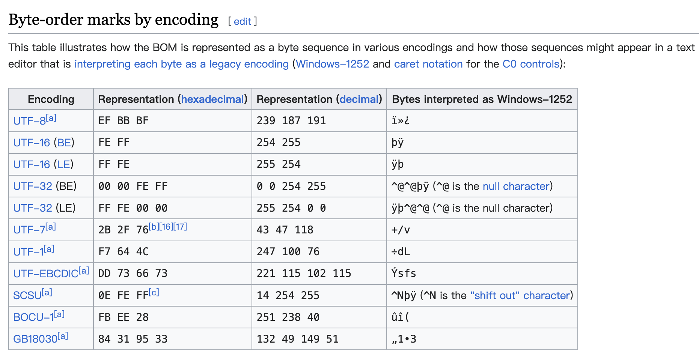

## CSV 文件处理和常见问题解决


### csv 文件写入


```go
// WriteCsv 将数据写入 csv 文件
// filename 指定写入文件
// header 指定数据表头
// rows 表示数据行
func WriteCsv(filename string, header []string, rows [][]string) error {
	fd, err := os.Create(filename)
	if err != nil {
		return err
	}
	defer fd.Close()

	// 写入 UTF-8 BOM，指定文件编码，防止 window 上乱码
	fd.WriteString("\xEF\xBB\xBF")

	w := csv.NewWriter(fd)
	if err := w.Write(header); err != nil {
		return err
	}

	if len(rows) > 0 {
		if err := w.WriteAll(rows); err != nil {
			return err
		}
	}

	w.Flush()
	return w.Error()
}
```


### web 导出 csv (以 gin 为例)


```go
func ExportCsv(c *gin.Context) {
	bytesBuffer := &bytes.Buffer{}
    
    // 写入 UTF-8 BOM，指定文件编码，防止 window 上乱码
	bytesBuffer.WriteString("\xEF\xBB\xBF") 

	writer := csv.NewWriter(bytesBuffer)
	writer.Write([]string{"ID", "姓名", "年龄"})
	writer.Write([]string{"1", "天王盖地虎", "23"})
	writer.Write([]string{"2", "小鸡炖蘑菇", "24"})

	writer.Flush() 

	// 设置下载的文件名
	c.Writer.Header().Set("Content-Disposition", "attachment;filename=data.csv")
	// 设置文件类型以及输出数据
	c.Data(http.StatusOK, "text/csv", bytesBuffer.Bytes())
	return
}
```


### BOM

BOM (Byte Order Mark, 字节顺序标记) 是用于指明文件字符编码格式和自己顺序的特殊字符。位于文件流开头，向读取文本的程序表明以下信息：

- 16 位或 32 位编码情况下的文本流的字节顺序或端序
- 文本流是以 unicode 编码的，可信度很高
- 使用的 unicode 字符编码





### 常见问题

#### csv 文件乱码

```go
// 写入 UTF-8 BOM，指定文件编码，防止 window 上乱码
fd.WriteString("\xEF\xBB\xBF")
```


#### record on line 2: wrong number of fields

解决：设置 `FieldsPerRecord = -1`

示例

```go
csvFile, _ := os.Open("file.csv")
r := csv.NewReader(bufio.NewReader(csvFile))
r.Comma = ';'
// 不检查每一行的字段数量
r.FieldsPerRecord = -1
```


#### parse error on line 1, column 4: bare " in non-quoted-field

解决：设置 `LazyQuotes = true`

示例

```go
fd, _ := os.Open("file.csv")
r := csv.NewReader(bufio.NewReader(fd))
r.Comma = ';'
r.LazyQuotes = true
```

