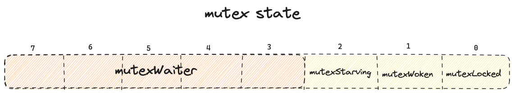
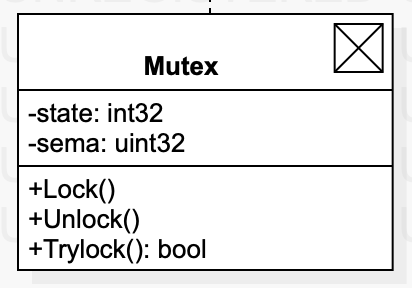

# sync

`sync` 包提供基本的同步原语，如互斥锁。除了 `Once` 和 `WaitGroup` 外大部分类型都是用于低层级库中使用。高层级同步最好通过 `channel` 和通信来完成

## Locker

```go
// A Locker represents an object that can be locked and unlocked.
type Locker interface {
	Lock()
	Unlock()
}
```

### Mutex 互斥锁

Mutex 的结构:

```go
type Mutex struct {
	// 锁的状态, 前 3 个低 bit 位，表示锁的状态，其他位表示等待者数量
	state int32
	// 信号量，参见：runtime/sema.go 的实现
	sema  uint32
}
```

`state` 状态

默认情况下，锁是处于非锁定状态的，所有状态位都是`0`，state int32 中不同位表示不同的状态，低 3 位分别表示一个状态位，从低到高依次是：

- `mutexLocked`: 已锁定状态
- `mutexWoken`:  被唤醒状态
- `mutexStarving`: 饥饿状态

剩余其他位表示当前锁上等待者 goroutine 的数量





Metex 的公平性

```
Mutex fairness.

Mutex can be in 2 modes of operations: normal and starvation.
In normal mode waiters are queued in FIFO order, but a woken up waiter
does not own the mutex and competes with new arriving goroutines over
the ownership. New arriving goroutines have an advantage -- they are
already running on CPU and there can be lots of them, so a woken up
waiter has good chances of losing. In such case it is queued at front
of the wait queue. If a waiter fails to acquire the mutex for more than 1ms,
it switches mutex to the starvation mode.

In starvation mode ownership of the mutex is directly handed off from
the unlocking goroutine to the waiter at the front of the queue.
New arriving goroutines don't try to acquire the mutex even if it appears
to be unlocked, and don't try to spin. Instead they queue themselves at
the tail of the wait queue.

If a waiter receives ownership of the mutex and sees that either
(1) it is the last waiter in the queue, or (2) it waited for less than 1 ms,
it switches mutex back to normal operation mode.

Normal mode has considerably better performance as a goroutine can acquire
a mutex several times in a row even if there are blocked waiters.
Starvation mode is important to prevent pathological cases of tail latency.
```


`sync.Mutex` 的公平性：
Mutex 有 2 种操作模式：正常模式和饥饿模式。
正常模式下，等待者按照 FIFO 顺序排队，但是被唤醒的等待者不拥有互斥量，而是和新到达的 goroutine 竞争锁的所有权。新到达的 goroutine 有一个优势 -- 它已经在 CPU 上运行了，且可能占用了很多 CPU，因此刚醒来的等待者较大概率会输。在这种情况下，它(刚被唤醒的等待者)会排在等待队列的前面。若等待者超过 1ms 仍未能获取互斥锁，它将互斥锁切换到饥饿模式

饥饿模式下，互斥锁的所有权直接从将解锁的 goroutine 移交到队列最前面的等待者那里。新到达的 goroutine 不会尝试获取锁，即使它看起来已解锁，也不会尝试自旋。相反，它们将自己排在队列的末尾

若等待者获得互斥锁的所有权，并发现其满足以下之一：
（1）它是等待队列中最后一个等待者
（2）它等待时长小于 1ms
则它将互斥锁切换回正常模式

正常模式有相当好的性能，因为即使有阻塞的等待者，goroutine 也可以连续多次获取锁。
饥饿模式对于防止尾部延迟的病理情况很重要




> 1. 若锁定一个已锁定的互斥锁，那么进行重复锁定的操作的 goroutine 将被阻塞，直到该互斥锁回到解锁状态
> 2. 当对一个未锁定的互斥锁进行解锁操作时，就会引发一个运行时恐慌（panic），避免这种情况发生的最简单、有效的方式是使用 defer 语句，更容易保证解锁操作的唯一性


#### Lock

```go
// Lock locks m.
// If the lock is already in use, the calling goroutine
// blocks until the mutex is available.
func (m *Mutex) Lock() {
	// Fast path: grab unlocked mutex.
	if atomic.CompareAndSwapInt32(&m.state, 0, mutexLocked) {
		if race.Enabled {
			race.Acquire(unsafe.Pointer(m))
		}
		return
	}
	// Slow path (outlined so that the fast path can be inlined)
	m.lockSlow()
}
```

方法执行：
1. 尝试使用原子操作 cas 设置锁，若成功，则返回，否则尝试第二步
2. 见 `lockSlow`


```go
func (m *Mutex) lockSlow() {
	var waitStartTime int64
	starving := false
	awoke := false
	iter := 0
	old := m.state
	for {
		// Don't spin in starvation mode, ownership is handed off to waiters
		// so we won't be able to acquire the mutex anyway.
		// 饥饿模式下，不自旋，锁的所有权已移交到等待者，因此我们无论如何也无法获取锁
		// 所以这里只在普通状态（已被锁定，且不是饥饿模式），且可自旋时进行自旋
		// runtime_canSpin 见 runtime 包的 sync_runtime_canSpin
		if old&(mutexLocked|mutexStarving) == mutexLocked && runtime_canSpin(iter) {
			// Active spinning makes sense.
			// Try to set mutexWoken flag to inform Unlock
			// to not wake other blocked goroutines.
			// 自旋是有道理的，尝试设置 mutexWoken 标志，以通知 Unlock 不要唤醒其他阻塞 goroutine
			if !awoke && old&mutexWoken == 0 && old>>mutexWaiterShift != 0 &&
				atomic.CompareAndSwapInt32(&m.state, old, old|mutexWoken) {
				awoke = true
			}
			runtime_doSpin()
			iter++
			old = m.state
			continue
		}
		new := old
		// Don't try to acquire starving mutex, new arriving goroutines must queue.
		if old&mutexStarving == 0 { // old 非饥饿模式
			new |= mutexLocked // new 标记 muteLocked
		}
		if old&(mutexLocked|mutexStarving) != 0 { // old 当前是普通模式或饥饿模式
			new += 1 << mutexWaiterShift
		}
		// The current goroutine switches mutex to starvation mode.
		// But if the mutex is currently unlocked, don't do the switch.
		// Unlock expects that starving mutex has waiters, which will not
		// be true in this case.
		if starving && old&mutexLocked != 0 { // starving && old in mutexLocked
			new |= mutexStarving // new 标记 mutexStarving
		}
		if awoke {
			// The goroutine has been woken from sleep,
			// so we need to reset the flag in either case.
			if new&mutexWoken == 0 {
				throw("sync: inconsistent mutex state")
			}
			// 清除标记位
			new &^= mutexWoken
		}
		if atomic.CompareAndSwapInt32(&m.state, old, new) {
			if old&(mutexLocked|mutexStarving) == 0 { // old 是非锁定状态
				break // locked the mutex with CAS
			}
			// If we were already waiting before, queue at the front of the queue.
			queueLifo := waitStartTime != 0 // queueLifo  If lifo is true, queue waiter at the head of wait queue.
			if waitStartTime == 0 {
				waitStartTime = runtime_nanotime()
			}
			runtime_SemacquireMutex(&m.sema, queueLifo, 1)
			// 当前等待锁超过 1ms
			starving = starving || runtime_nanotime()-waitStartTime > starvationThresholdNs
			old = m.state
			if old&mutexStarving != 0 { // old in mutexStarving status
				// If this goroutine was woken and mutex is in starvation mode,
				// ownership was handed off to us but mutex is in somewhat
				// inconsistent state: mutexLocked is not set and we are still
				// accounted as waiter. Fix that.
				if old&(mutexLocked|mutexWoken) != 0 || old>>mutexWaiterShift == 0 {
					throw("sync: inconsistent mutex state")
				}
				delta := int32(mutexLocked - 1<<mutexWaiterShift)
				if !starving || old>>mutexWaiterShift == 1 {
					// Exit starvation mode.
					// Critical to do it here and consider wait time.
					// Starvation mode is so inefficient, that two goroutines
					// can go lock-step infinitely once they switch mutex
					// to starvation mode.
					delta -= mutexStarving
				}
				atomic.AddInt32(&m.state, delta)
				break
			}
			
			awoke = true
			iter = 0
		} else {
			old = m.state
		}
	}

	if race.Enabled {
		race.Acquire(unsafe.Pointer(m))
	}
}
```

`runtime_canSpin` 的条件，满足以下条件:
- 自旋次数小与 4
- 多核机器，cpu 核心数 > 1
- P 大于1，且至少一个 P 正在运行且运行队列为空


```go
// Active spinning for sync.Mutex.
//
//go:linkname sync_runtime_canSpin sync.runtime_canSpin
//go:nosplit
func sync_runtime_canSpin(i int) bool {
	// sync.Mutex is cooperative, so we are conservative with spinning.
	// Spin only few times and only if running on a multicore machine and
	// GOMAXPROCS>1 and there is at least one other running P and local runq is empty.
	// As opposed to runtime mutex we don't do passive spinning here,
	// because there can be work on global runq or on other Ps.
    // active_spin = 4
	if i >= active_spin || ncpu <= 1 || gomaxprocs <= sched.npidle.Load()+sched.nmspinning.Load()+1 {
		return false
	}
	if p := getg().m.p.ptr(); !runqempty(p) {
		return false
	}
	return true
}
```

`runtime_doSpin` 见 `runtime.sync_runtime_doSpin`

```go
//go:linkname sync_runtime_doSpin sync.runtime_doSpin
//go:nosplit
func sync_runtime_doSpin() {
    // active_spin_cnt = 30
	procyield(active_spin_cnt)
}

// runtime/asm_arm64.s
TEXT runtime·procyield(SB),NOSPLIT,$0-0
	MOVWU	cycles+0(FP), R0
again:
	YIELD
	SUBW	$1, R0
	CBNZ	R0, again
	RET
```


#### Unlock


```go
// Unlock unlocks m.
// It is a run-time error if m is not locked on entry to Unlock.
//
// A locked Mutex is not associated with a particular goroutine.
// It is allowed for one goroutine to lock a Mutex and then
// arrange for another goroutine to unlock it.
func (m *Mutex) Unlock() {
	if race.Enabled {
		_ = m.state
		race.Release(unsafe.Pointer(m))
	}

	// Fast path: drop lock bit.
	new := atomic.AddInt32(&m.state, -mutexLocked)
	if new != 0 {
		// Outlined slow path to allow inlining the fast path.
		// To hide unlockSlow during tracing we skip one extra frame when tracing GoUnblock.
		m.unlockSlow(new)
	}
}

func (m *Mutex) unlockSlow(new int32) {
	if (new+mutexLocked)&mutexLocked == 0 {
		// new drop lock bit 前就不含 lock bit
		fatal("sync: unlock of unlocked mutex")
	}
	if new&mutexStarving == 0 { // new 非饥饿模式
		old := new
		for {
			// If there are no waiters or a goroutine has already
			// been woken or grabbed the lock, no need to wake anyone.
			// In starvation mode ownership is directly handed off from unlocking
			// goroutine to the next waiter. We are not part of this chain,
			// since we did not observe mutexStarving when we unlocked the mutex above.
			// So get off the way.
			// 若 new 中不含等待者，或某个 goroutine 已经被唤醒或者获得了锁，就没有必要唤醒任何人了
			// 在饥饿模式下，所有权从解锁中的 goroutine 直接交给下一个等待者。我们不是这一环节的一部分，
			// 因为我们未能观测到 饥饿状态 当我们解锁上面的锁时，因此我们离开吧
			if old>>mutexWaiterShift == 0 || old&(mutexLocked|mutexWoken|mutexStarving) != 0 {
				return
			}
			// Grab the right to wake someone.
			new = (old - 1<<mutexWaiterShift) | mutexWoken // 等待者数量减1，并标记 woken
			if atomic.CompareAndSwapInt32(&m.state, old, new) {
				// 从等待者队列唤醒一位，不移交所有权
				runtime_Semrelease(&m.sema, false, 1)
				return
			}
			old = m.state
		}
	} else {
		// Starving mode: handoff mutex ownership to the next waiter, and yield
		// our time slice so that the next waiter can start to run immediately.
		// Note: mutexLocked is not set, the waiter will set it after wakeup.
		// But mutex is still considered locked if mutexStarving is set,
		// so new coming goroutines won't acquire it.
		// 饥饿模式: 将互斥锁所有权移交给下一个等待者，并让出我们的时间片，以便下一个等待者可以立即开始运行
		// 注意：lock bit 位没有设置，等待着醒来后会设置。但如果设置了 starving bit位，则 mutex 仍认为是锁定状态
		// 因此新的 goroutine 将无法获得它
		runtime_Semrelease(&m.sema, true, 1)
	}
}

```

### RWMutex 读写锁

针对读写操作的互斥锁。

与普通的互斥锁不同之处：    
（1） 可以分别针对读操作和写操作进行锁定和解锁操作   
（2） 遵循的访问控制规则不同，读写锁控制下的多个写操作之间是互斥的，并且写操作与读操作之间也是互斥的。但是，多个读操作之间却不存在互斥关系

> 在这样的互斥策略下，读写锁可以在大大降低因使用锁而造成的性能损耗的情况下，完成对共享资源的访问控制

读写锁结构体 `sync.RWMutex`

#### 写锁

写锁定，如下：

```go
func (rw *RWMutex) Lock()
```

写解锁，如下

```go
func (rw *RWMutex) Unlock()
```

#### 读锁

读锁定，如下：

```go
func (rw *RWMutex) RLock()
```

读解锁，如下：

```go
func (rw *RWMutex) RUnlock()
```

#### RLocker

```go
func (rw *RWMutex) RLocker() * Locker {}
```

`RLocker` 该方法返回一个实现里 sync.Locker 接口类型的值。

sync.Locker 接口定义：

```go
// A Locker represents an object that can be locked and unlocked.
type Locker interface {
	Lock()
	Unlock()
}
```

实现 Locker 接口类型的实现类型

- *sync.Mutex
- *sync.RWMutex

### Cond 条件变量

`sync.Cond` 类型代表了`条件变量`

#### New Cond

```go
// NewCond returns a new Cond with Locker l.
func NewCond(l Locker) *Cond {
	return &Cond{L: l}
}
```

#### *Cond.Wait()

`Wait` 方法会自动地对该条件变量关联的那个锁进行解锁，并且使它所在的 goroutine 阻塞。一旦接收到通知，该方法所在的 goroutine 就会被唤醒，并且该方法会立即尝试锁定该锁。

```go
// Wait atomically unlocks c.L and suspends execution
// of the calling goroutine. After later resuming execution,
// Wait locks c.L before returning. Unlike in other systems,
// Wait cannot return unless awoken by Broadcast or Signal.
//
// Because c.L is not locked when Wait first resumes, the caller
// typically cannot assume that the condition is true when
// Wait returns. Instead, the caller should Wait in a loop:
//
//    c.L.Lock()
//    for !condition() {
//        c.Wait()
//    }
//    ... make use of condition ...
//    c.L.Unlock()
//
func (c *Cond) Wait() {
	c.checker.check()
	t := runtime_notifyListAdd(&c.notify)
	c.L.Unlock()
	runtime_notifyListWait(&c.notify, t)
	c.L.Lock()
}
```

## 原子操作

原子操作即执行过程中不能被中断的操作。在针对某个值的原子操作执行过程当中，CPU绝不会再去执行其他针对该值的操作，无论这些其他操作是否为原子操作。

sync/atomic 包中函数，可以对几种简单类型的值执行原子操作。这些类型包括以下 6 种：
- int32
- int64
- uint32
- uint64
- uintptr
- unsafe.Pointer

这些函数提供的原子操作共 5 种：
- 增或减
- 比较并交换
- 载入
- 存储
- 交换

不同原子操作适应场景有所区别

### 增或减


# 附加

悲观锁/乐观锁


自旋锁（乐观锁的一种）

什么是自旋锁？

自旋锁有啥问题？

 - ABA 问题？如何解决（加版本号）？
    - 在乎变化次数的，记录版本变更历史
    - 不在乎变化次数的，可以使用 true/false 标记
 - 更严重的问题：比较和更新是否能保证原子性（cas）
