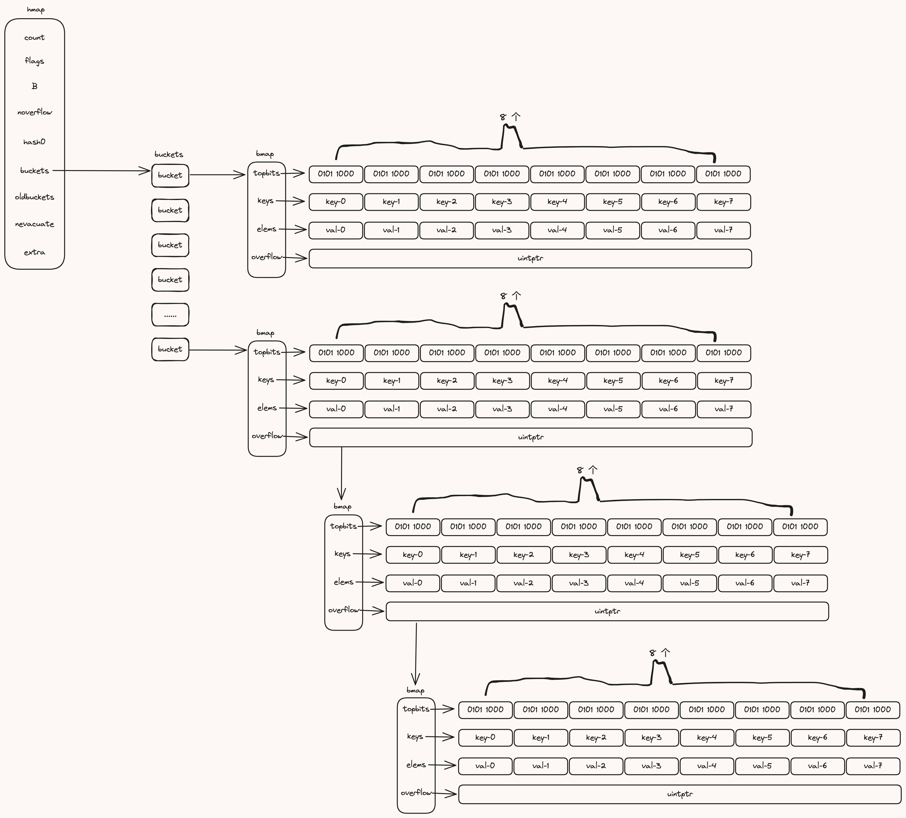
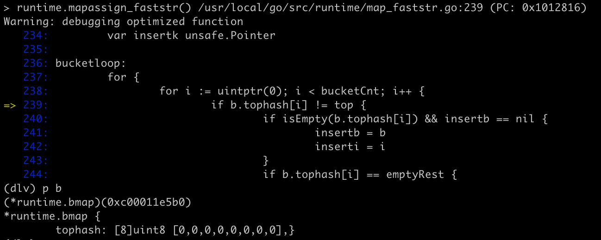
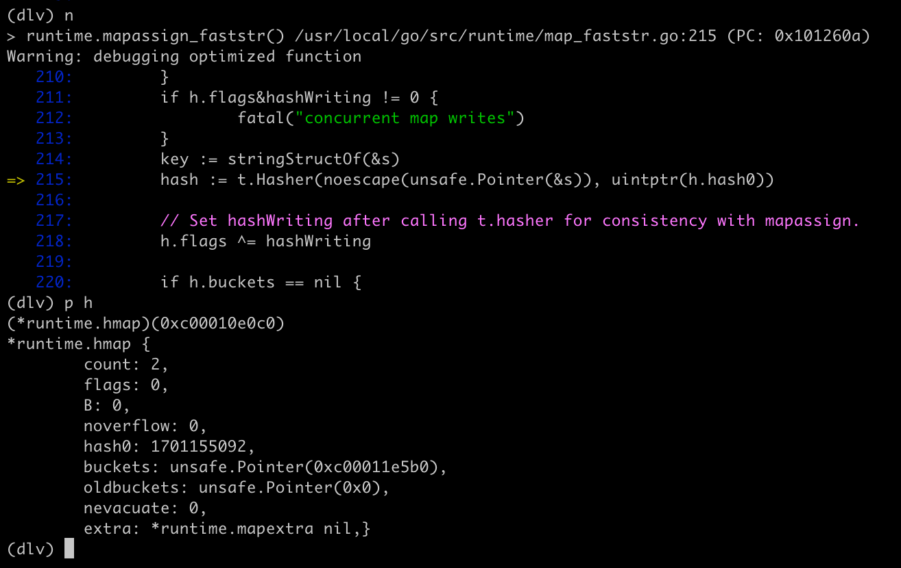
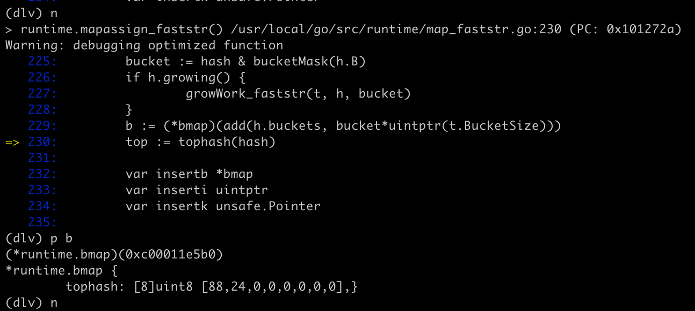

# map

map 用于存储一系列 k/v 键值对, 迭代遍历时返回元素的顺序是乱序的，和 key 的存储顺序无关

## 数据结构

先整体看下 map 在内存中的布局：




map 底层是一个 hash table， hash table 的数组元素就是下文中说的 bucket,  每个 bucket 表示的一个 `bmap` 的对象

```go
type bmap struct {
	topbits  [8]uint8
	keys     [8]keytype
	elems    [8]elemtype
	overflow uintptr
}
```

存储 key 的 hashcode 的高 8 位，按开放寻址法依次存入 topbit, key 依次存在 keys, value 则依次存在 elems 中，若数组中已存满 8 个key，则溢出一个 `bmap`，通过 overflow 连接，对于溢出桶的连接使用了拉链法。

若是一个 bucket 中的元素增长到一定数量后，查询将趋向于线性查询了，所以这时候就需要扩容和迁移了，具体策略见 扩容和迁移


看一下 map 运行时的相关数据结构

```go
// map flags
iterator     = 1 // there may be an iterator using buckets
oldIterator  = 2 // there may be an iterator using oldbuckets
hashWriting  = 4 // a goroutine is writing to the map
sameSizeGrow = 8 // the current map growth is to a new map of the same size


// A header for a Go map.
type hmap struct {
	// Note: the format of the hmap is also encoded in cmd/compile/internal/gc/reflect.go.
	// Make sure this stays in sync with the compiler's definition.
	count     int // map 中元素的数量
	flags     uint8 // map 当前状态标识，见 flags
	B         uint8  // 用于计算 bucket 的数量，len(buckts) = 2^B, 桶的最大数量是：loadFactor * 2^B
	noverflow uint16 // 溢出桶数量的近似值，详细见 hmap.incrnoverflow() 方法
	hash0     uint32 // 哈希种子，能为哈希函数的结果引入不确定性，值在创建哈希表时确定，并在调用哈希函数时作为参数传入

	buckets    unsafe.Pointer // *[2^B]*bmap 长度为 2^B 的桶数组，若 count==0，则为nil
	oldbuckets unsafe.Pointer // 扩容时用于保存 buckets 的字段，扩容时不会是 nil，大小是 buckets 的一半
	nevacuate  uintptr        // 稀疏进度计数器 progress counter for evacuation (buckets 小于改值时已被稀疏)

	extra *mapextra // optional fields
}
```

```go
// A bucket for a Go map.
type bmap struct {
	// tophash generally contains the top byte of the hash value
	// for each key in this bucket. If tophash[0] < minTopHash,
	// tophash[0] is a bucket evacuation state instead.
	tophash [bucketCnt]uint8 // 8 个键值对
	// Followed by bucketCnt keys and then bucketCnt elems.
	// NOTE: packing all the keys together and then all the elems together makes the
	// code a bit more complicated than alternating key/elem/key/elem/... but it allows
	// us to eliminate padding which would be needed for, e.g., map[int64]int8.
	// Followed by an overflow pointer.
}
```

`bmap` 在运行时的字段还有更多的字段信息，由于哈希表中可存储不同类型的键值对，且 Go 不支持范型，所以键值对占用的内存大小只能在编译期间进行推导；这些隐含字段在运行时也是通过计算内存地址的方式直接访问的，根据编译期间的 `cmd/compileinternal/gc.hmap` 函数对它的结构重建：

```go
type bmap struct {
	topbits  [8]uint8
	keys     [8]keytype
	elems    [8]elemtype
	overflow uintptr
}
```

```go
// mapextra holds fields that are not present on all maps.
type mapextra struct {
	// If both key and elem do not contain pointers and are inline, then we mark bucket
	// type as containing no pointers. This avoids scanning such maps.
	// However, bmap.overflow is a pointer. In order to keep overflow buckets
	// alive, we store pointers to all overflow buckets in hmap.extra.overflow and hmap.extra.oldoverflow.
	// overflow and oldoverflow are only used if key and elem do not contain pointers.
	// overflow contains overflow buckets for hmap.buckets.
	// oldoverflow contains overflow buckets for hmap.oldbuckets.
	// The indirection allows to store a pointer to the slice in hiter.
	overflow    *[]*bmap
	oldoverflow *[]*bmap

	// nextOverflow holds a pointer to a free overflow bucket.
	nextOverflow *bmap
}
```

map 其实是一个 hash table. 数据保存在桶（`bucket`）中的数组中，每个桶最多可以存放 8 对键值对。hash 冲突采用拉链法解决；若 hash 选中的 bucket数组位置已满，则创建溢出桶继续保存数据。key 的哈希值的 *低位* 用来选择 key 存放在哪个 bucket, *高 8 位* 用来确定 key 在 bucket 中数组的哪个索引位置

当 hash 表扩容时，bucket 的数量是以 `2^B` 增长。将逐渐的从旧桶中复制数据到新桶


## 初始化

初始化的 map 的两种方法：
- 通过字面量初始化
- 通过 make 关键字在运行时初始化


字面量初始化 map：

```go
package main

import (
	"fmt"
)

func main() {
	m := map[string]int{
		"1": 1,
	}
	fmt.Println(m)
}
```

使用 `make` 关键字初始化：

```go
package main

import (
	"fmt"
)

func main() {
	m := make(map[string]int, 2)
	m["1"] = 1
	fmt.Println(m)
}
```

以上 2 种初始化方式，无论通过哪种方式，我们通过汇编查看发现，都会调用 `runtime.makemap_small` 来初始化 map，然后调用 `runtime.mapassign_faststr` 来进行赋值

`makemap_small` 其实是 `makemap` 的同类函数之一，还有同类函数`makemap64`, 这里主要看一下 `makemap`:

```go

// makemap_small implements Go map creation for make(map[k]v) and
// make(map[k]v, hint) when hint is known to be at most bucketCnt
// at compile time and the map needs to be allocated on the heap.
func makemap_small() *hmap {
	h := new(hmap)
	h.hash0 = fastrand()
	return h
}

// hint 即 cap 容量
// makemap implements Go map creation for make(map[k]v, hint).
// If the compiler has determined that the map or the first bucket
// can be created on the stack, h and/or bucket may be non-nil.
// If h != nil, the map can be created directly in h.
// If h.buckets != nil, bucket pointed to can be used as the first bucket.
func makemap(t *maptype, hint int, h *hmap) *hmap {
	// 计算 hint 个 key 需要的桶内存大小，及是否会内存溢出
	mem, overflow := math.MulUintptr(uintptr(hint), t.Bucket.Size_)
	if overflow || mem > maxAlloc {
		hint = 0
	}

	// initialize Hmap
	if h == nil {
		h = new(hmap)
	}
	h.hash0 = fastrand()

	// Find the size parameter B which will hold the requested # of elements.
	// For hint < 0 overLoadFactor returns false since hint < bucketCnt.
	B := uint8(0)
	for overLoadFactor(hint, B) {
		B++
	}
	h.B = B

	// 若 B == 0， 则分配初始 hash table，bucket 字段延迟分配（在 mapassign 方法中）
	// 若 hint 容量很大，则清零此内存可能需要一段时间
	// allocate initial hash table
	// if B == 0, the buckets field is allocated lazily later (in mapassign)
	// If hint is large zeroing this memory could take a while.
	if h.B != 0 {
		var nextOverflow *bmap
		h.buckets, nextOverflow = makeBucketArray(t, h.B, nil)
		if nextOverflow != nil {
			h.extra = new(mapextra)
			h.extra.nextOverflow = nextOverflow
		}
	}

	return h
}

// makeBucketArray initializes a backing array for map buckets.
// 1<<b is the minimum number of buckets to allocate.
// dirtyalloc should either be nil or a bucket array previously
// allocated by makeBucketArray with the same t and b parameters.
// If dirtyalloc is nil a new backing array will be alloced and
// otherwise dirtyalloc will be cleared and reused as backing array.
func makeBucketArray(t *maptype, b uint8, dirtyalloc unsafe.Pointer) (buckets unsafe.Pointer, nextOverflow *bmap) {
	base := bucketShift(b)
	nbuckets := base
	// For small b, overflow buckets are unlikely.
	// Avoid the overhead of the calculation.
	if b >= 4 {
		// Add on the estimated number of overflow buckets
		// required to insert the median number of elements
		// used with this value of b.
		nbuckets += bucketShift(b - 4)
		sz := t.Bucket.Size_ * nbuckets
		up := roundupsize(sz)
		if up != sz {
			nbuckets = up / t.Bucket.Size_
		}
	}

	if dirtyalloc == nil {
		buckets = newarray(t.Bucket, int(nbuckets))
	} else {
		// dirtyalloc was previously generated by
		// the above newarray(t.Bucket, int(nbuckets))
		// but may not be empty.
		buckets = dirtyalloc
		size := t.Bucket.Size_ * nbuckets
		if t.Bucket.PtrBytes != 0 {
			memclrHasPointers(buckets, size)
		} else {
			memclrNoHeapPointers(buckets, size)
		}
	}

	if base != nbuckets {
		// We preallocated some overflow buckets.
		// To keep the overhead of tracking these overflow buckets to a minimum,
		// we use the convention that if a preallocated overflow bucket's overflow
		// pointer is nil, then there are more available by bumping the pointer.
		// We need a safe non-nil pointer for the last overflow bucket; just use buckets.
		nextOverflow = (*bmap)(add(buckets, base*uintptr(t.BucketSize)))
		last := (*bmap)(add(buckets, (nbuckets-1)*uintptr(t.BucketSize)))
		last.setoverflow(t, (*bmap)(buckets))
	}
	return buckets, nextOverflow
}
```


## 访问

### 查找

查找有 2 种形式，如下：

- `v := map[k]`
- `v, ok := map[k]`


### 迭代遍历

```go
for k, v := range map {
	fmt.Println("k:", k, ", v:", v)
}
```


## 赋值

源码走读
```go
// Like mapaccess, but allocates a slot for the key if it is not present in the map.
func mapassign(t *maptype, h *hmap, key unsafe.Pointer) unsafe.Pointer {
	if h == nil {
		panic(plainError("assignment to entry in nil map"))
	}
	if raceenabled {
		callerpc := getcallerpc()
		pc := abi.FuncPCABIInternal(mapassign)
		racewritepc(unsafe.Pointer(h), callerpc, pc)
		raceReadObjectPC(t.Key, key, callerpc, pc)
	}
	if msanenabled {
		msanread(key, t.Key.Size_)
	}
	if asanenabled {
		asanread(key, t.Key.Size_)
	}
	if h.flags&hashWriting != 0 {
		fatal("concurrent map writes")
	}

	// 计算 key 的 hash 值
	hash := t.Hasher(key, uintptr(h.hash0))

	// 标记当前正在写入
	// Set hashWriting after calling t.hasher, since t.hasher may panic,
	// in which case we have not actually done a write.
	h.flags ^= hashWriting

	if h.buckets == nil {
		h.buckets = newobject(t.Bucket) // newarray(t.Bucket, 1)
	}

again:
	// 提取 hash 值和bucket掩码操作，提取 低 h.B 位
	bucket := hash & bucketMask(h.B)
	if h.growing() {
		growWork(t, h, bucket)
	}
	// 找到 bucket
	b := (*bmap)(add(h.buckets, bucket*uintptr(t.BucketSize)))
	// 取高 8 位
	top := tophash(hash)

	var inserti *uint8
	var insertk unsafe.Pointer
	var elem unsafe.Pointer
bucketloop:
	for {
		// 在桶数组中，开放寻址法，依次查找
		for i := uintptr(0); i < bucketCnt; i++ {
			if b.tophash[i] != top {
				// 空槽
				if isEmpty(b.tophash[i]) && inserti == nil {
					inserti = &b.tophash[i]
					insertk = add(unsafe.Pointer(b), dataOffset+i*uintptr(t.KeySize))
					elem = add(unsafe.Pointer(b), dataOffset+bucketCnt*uintptr(t.KeySize)+i*uintptr(t.ValueSize))
				}
				if b.tophash[i] == emptyRest {
					break bucketloop
				}
				continue
			}
			// top hash 已存在了
			// 找存在 key 的地址
			k := add(unsafe.Pointer(b), dataOffset+i*uintptr(t.KeySize))
			if t.IndirectKey() {
				k = *((*unsafe.Pointer)(k))
			}
			// 但 key 不同
			if !t.Key.Equal(key, k) {
				continue
			}
			// already have a mapping for key. Update it.
			if t.NeedKeyUpdate() {
				typedmemmove(t.Key, k, key)
			}
			// 找存储 value 的地址
			elem = add(unsafe.Pointer(b), dataOffset+bucketCnt*uintptr(t.KeySize)+i*uintptr(t.ValueSize))
			goto done
		}
		ovf := b.overflow(t)
		if ovf == nil {
			break
		}
		// 若未找到，切有溢出桶，则在溢出桶中继续查找
		b = ovf
	}

	// Did not find mapping for key. Allocate new cell & add entry.

	// If we hit the max load factor or we have too many overflow buckets,
	// and we're not already in the middle of growing, start growing.
	if !h.growing() && (overLoadFactor(h.count+1, h.B) || tooManyOverflowBuckets(h.noverflow, h.B)) {
		hashGrow(t, h)
		goto again // Growing the table invalidates everything, so try again
	}

	if inserti == nil {
		// The current bucket and all the overflow buckets connected to it are full, allocate a new one.
		newb := h.newoverflow(t, b)
		inserti = &newb.tophash[0]
		insertk = add(unsafe.Pointer(newb), dataOffset)
		elem = add(insertk, bucketCnt*uintptr(t.KeySize))
	}

	// store new key/elem at insert position
	if t.IndirectKey() {
		kmem := newobject(t.Key)
		*(*unsafe.Pointer)(insertk) = kmem
		insertk = kmem
	}
	if t.IndirectElem() {
		vmem := newobject(t.Elem)
		*(*unsafe.Pointer)(elem) = vmem
	}
	typedmemmove(t.Key, insertk, key)
	*inserti = top
	h.count++

done:
	if h.flags&hashWriting == 0 {
		fatal("concurrent map writes")
	}
	h.flags &^= hashWriting
	if t.IndirectElem() {
		elem = *((*unsafe.Pointer)(elem))
	}
	return elem
}
```









## 删除


## 扩容和迁移


## 相关文章

- https://blog.golang.org/go-maps-in-action
